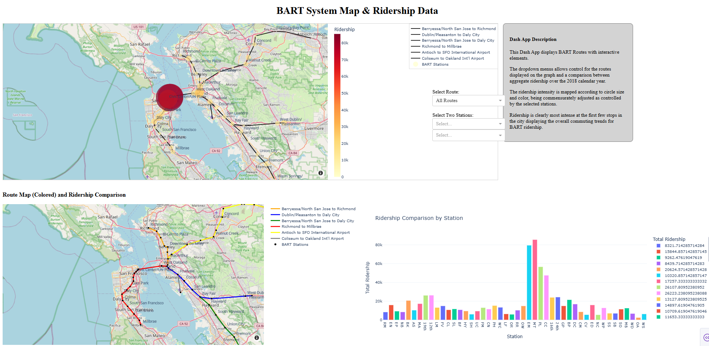

# BART Ridership Dashboard



Interactive Dash + Plotly app with GeoPandas/Shapely maps to explore BART ridership and routes.

## Features
- Interactive station/route maps
- Station-level ridership comparison for 2018
- Filters for route and station pair
- Geospatial visualizations with GeoPandas and Shapely

## Quickstart (Windows)

```powershell
python -m venv .venv
.\.venv\Scripts\Activate
pip install -r requirements.txt
python app.py
```

App runs at http://127.0.0.1:8050/

## Data
Place raw files under `data/raw/` (already in this repo for demo). Processed outputs are written to `data/processed/`.

## Tech Stack
Python, Dash, Plotly, GeoPandas, Shapely, Pandas.


