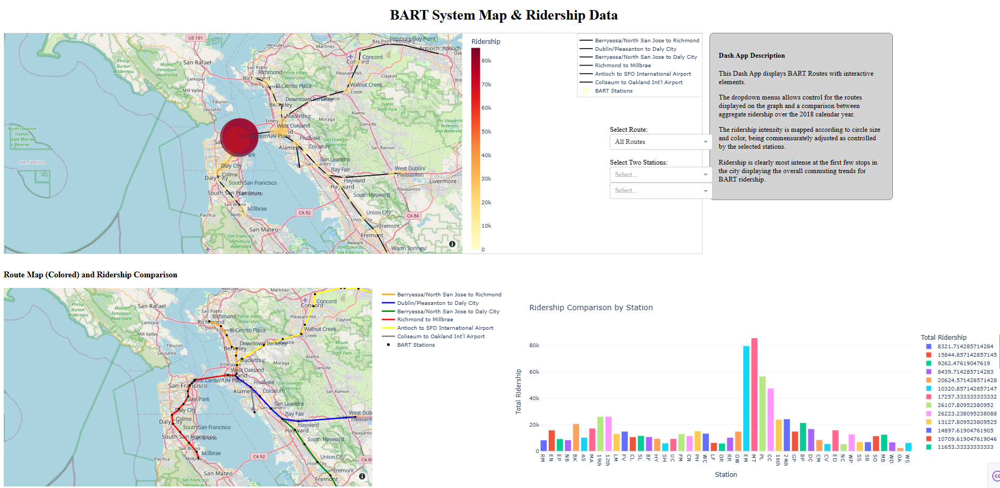

# BART Ridership Dashboard



Interactive Dash + Plotly app with GeoPandas/Shapely maps to explore BART ridership and routes.

## Features
- Interactive station/route maps
- Station-level monthly ridership comparison
- Filters for route service year, ridership period, route, and station pair
- Geospatial visualizations with GeoPandas and Shapely

## Quickstart (Windows)

```powershell
python -m venv .venv
.\.venv\Scripts\Activate
pip install -r requirements.txt
python app.py
```

App runs at http://127.0.0.1:8050/

## Project Layout

- `app.py`: Dash app entrypoint, layout, and callbacks.
- `src/data_loader.py`: processed artifact loading plus preprocessing helpers.
- `src/route_builder.py`: curated BART route geometry corrections.
- `src/station_mapping.py`: station abbreviation to station-name mapping.
- `scripts/prepare_data.py`: optional raw-to-processed data export script.

## Data
Raw source files belong under `data/raw/`, which is ignored by Git because some files are too large for normal GitHub uploads. The app runs from tracked processed files in `data/processed/`; raw files are only needed when regenerating those artifacts. See [DATA_SETUP.md](DATA_SETUP.md) for the required files, the included sample CSV, and the full-data download link.

## Tech Stack
Python, Dash, Plotly, GeoPandas, Shapely, Pandas.


## Notes
Hourly OD CSVs are aggregated into monthly station files and used as the canonical app ridership source where available. Workbook Total Trips files are retained as validation benchmarks and fallback data for periods without hourly OD coverage.
Workbook station abbreviations are normalized into canonical app codes during preprocessing, including legacy labels around Pittsburg/Bay Point, West Dublin/Pleasanton, and Warm Springs/South Fremont.
